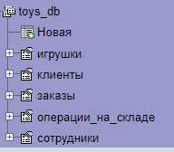

# Installation

## 1.Download and install project

```sh {"id":"01HPQFP4CG8FJAQKFBEY4GWGHE"}
git clone https://github.com/Ramiladze/gggggg3
cd gggggg3
npm i
```

## 2.Import BD to PhpMyAdmin



## 3.Run project

```sh {"id":"01HPQFP4CGWAHQN0SBHE9PDPK3"}
npm start
```
